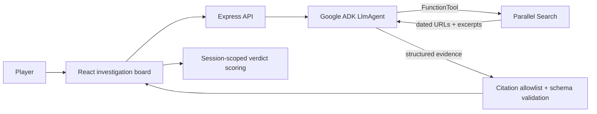

# The Rumor Room

**A noir web-investigation game where live evidence—not trivia—decides which entertainment claim cannot survive scrutiny.**

Built for the **Agentic Cinema: The Blockbuster Hackathon**, Parallel partner track.

## Play the game

### **[Launch The Rumor Room →](https://rumor-room-dpq2d26l7q-uc.a.run.app)** · **[Watch the 3-minute demo →](https://youtu.be/ovbrx_9RvN8)**

No installation is required. This is the live Google Cloud deployment using Gemini and Parallel Search.

## Proof this is live

Every research turn on the hosted site runs Gemini through Google ADK, which calls Parallel Search as a tool. The board can only show URLs that came back from that Parallel call.

| What | Evidence |
| --- | --- |
| Hosted app | [`rumor-room-dpq2d26l7q-uc.a.run.app`](https://rumor-room-dpq2d26l7q-uc.a.run.app) on Google Cloud Run, revision `rumor-room-00006-2tj` |
| Status badge in-game | Top right reads **Parallel live search** (fixture mode cannot boot in production) |
| Runtime Parallel call | Cloud Run log entry `parallel_search_completed` with search ID `search_85ade4fdd5244f13f2e9fa33bed17c66`, six results, consumed by `gemini-3.7-flash`; the entry lists Gemini's three queries (`agentQueries`) and the two case-authored coverage queries (`coverageQueries`) separately |
| Three more live search IDs, one per case | `search_714f7e26…`, `search_72d1bc94…`, `search_0344fc17…` in [docs/internal/LIVE_VALIDATION.md](docs/internal/LIVE_VALIDATION.md) |
| Google AI layer | [`server/providers/live-provider.ts`](server/providers/live-provider.ts): `LlmAgent`, `Runner`, `FunctionTool` from `@google/adk`; no other model provider in the dependency tree |
| Citation trust boundary | `requireParallelCitations()` drops any URL Gemini returns that Parallel did not |
| Demo video | [youtu.be/ovbrx_9RvN8](https://youtu.be/ovbrx_9RvN8) — 179-second walkthrough with three live production Parallel searches, captioned |


<details>
<summary>See the case briefing and evidence receipt</summary>


</details>

## The pitch

Four plausible claims arrive at the newsroom. Exactly one is unsupported, outdated, or materially misleading within the case's stated time window.

The player gets **four research tokens—meaning four total research turns**. On each turn, select any claim and apply one of four move types:

- **Trace It** — find the earliest discoverable origin.
- **Second Source** — look for genuinely independent corroboration.
- **Studio Line** — prioritize the organizations closest to the facts.
- **Fresh Cut** — search after the claim for corrections, denials, and changed plans.

You may switch claims between turns, focus multiple turns on one claim, or reuse a move type. You may also accuse at any time—including before using every turn.

Every research turn calls a Gemini investigator built with Google ADK. Gemini chooses a research objective, calls Parallel Search as a tool, evaluates provenance and freshness, and returns dated source receipts that physically change the case board. The player then accuses one claim and receives a scored evidence receipt.

## Why the integrations matter

Parallel is not an ornamental search box. Fresh web evidence is the game state.

- A stale date can look perfectly sourced until **Fresh Cut** finds the later announcement.
- Ten headlines can collapse into one origin when **Second Source** traces circular reporting.
- A famous producer can be promoted into the director's chair until **Studio Line** retrieves the exact credit.

Gemini is the investigator: it translates each strategic move into a focused research objective, operates the Parallel tool, and turns the tool output into a small, provenance-aware evidence bundle. The server rejects any citation that was not present in the actual Parallel response.

## Current build

- Three hand-designed cases. One teaches outdated information, one teaches how many articles can repeat the same source, and one teaches how a headline can overstate what its source actually says.
- Four claims, four research turns, one accusation, a per-case score, and an accumulating three-case campaign score.
- Responsive physical evidence-board interface.
- Adaptive Tone.js electro-noir soundtrack and semantic cues.
- Mute control, audio-independent play, visible state communication, keyboard focus, and reduced-motion support.
- Saved-evidence test mode for repeatable local development and automated tests. The alternative is live mode, where Gemini calls Parallel Search on every research turn.
- A deployment safety check that refuses to start production unless live Gemini + Parallel mode is enabled. This prevents accidentally submitting a version that uses saved test evidence.
- Google ADK 2.0 + Gemini 3.7 Flash + Parallel Search live provider.
- Unit, integrity, trust-boundary, desktop browser, and mobile browser tests.
- Cloud Run container and Cloud Build deployment configuration.

The complete Gemini → Google ADK → Parallel path has been exercised across all three hand-designed cases and through a full browser verdict on the public Cloud Run deployment.

## Game rules at a glance

- There are **three cases** in the current game.
- Each case presents **four claims**. Exactly one is unsupported, outdated, or materially misleading for that case—not necessarily a completely invented statement.
- You have **four research turns** per case. The round tokens are simply a visual counter for those four turns.
- Select any claim, then apply a research move to that selected claim.
- You can switch claims between turns, reuse a move type, or focus several turns on one claim.
- You can accuse at any time. A strong first search can solve a case; using all four turns is not mandatory.
- The receipt shows a case score. The campaign score accumulates across all three cases and resets when you choose **Start over** or finish the campaign.

## Runtime integration proof

### Gemini and Google ADK

- [`server/providers/live-provider.ts`](server/providers/live-provider.ts) imports `LlmAgent`, `Runner`, `FunctionTool`, and `InMemorySessionService` from `@google/adk`, creates the Gemini investigator, and executes it for every live research turn.
- [`cloudbuild.yaml`](cloudbuild.yaml) configures Gemini Enterprise mode, the Google Cloud project, Gemini 3.7 Flash, and the dedicated `rumor-room-runtime` service account.
- Google does **not** use a committed API key. Local development uses Application Default Credentials. Production uses the Cloud Run service account identity.

### Parallel Search

- The `parallel_search` `FunctionTool` in [`server/providers/live-provider.ts`](server/providers/live-provider.ts) calls `parallel.search(...)` from the official `parallel-web` SDK.
- The Parallel key is stored in Google Secret Manager as `parallel-api-key` and injected into Cloud Run by [`cloudbuild.yaml`](cloudbuild.yaml). Its value is never sent to the browser or committed.
- [`docs/internal/LIVE_VALIDATION.md`](docs/internal/LIVE_VALIDATION.md) records real search IDs, effective queries, cited URLs, and all three live case results.
- [`docs/internal/DEPLOYMENT_REPORT.md`](docs/internal/DEPLOYMENT_REPORT.md) records the Cloud Run revision and the structured production log proving the Parallel tool executed.

## Architecture



The client never receives the answer key. Evidence and scores are scoped to a generated player session. Production requires `INVESTIGATION_MODE=live`; saved test evidence is intentionally limited to local development and automated testing.

See [Architecture](docs/ARCHITECTURE.md) for the full request path and trust boundaries.

## Run locally

Requires Node.js 22 or newer.

```bash
npm install
cp .env.example .env
npm run dev
```

Open `http://127.0.0.1:5173`. By default, local development uses saved evidence so every test run receives the same sources and scores. Set live mode to use the real Gemini + Parallel path instead.

## Run the live investigator locally

Authenticate with Google Cloud Application Default Credentials, add a Parallel API key, and change the following values in `.env`:

```dotenv
APP_ENV=development
INVESTIGATION_MODE=live
GOOGLE_CLOUD_PROJECT=your-project-id
GOOGLE_CLOUD_LOCATION=global
GOOGLE_GENAI_USE_ENTERPRISE=true
GOOGLE_MODEL=gemini-3.7-flash
PARALLEL_API_KEY=your-key
```

Then run `npm run dev`. The top-right status changes from **Saved test evidence** to **Parallel live search**.

## Quality gates

```bash
npm run check       # lint + unit tests + production build
npm run test:e2e    # Chromium desktop + mobile flows
npm audit           # dependency advisory check
```

Validated locally on August 28, 2026:

- 16 unit/integrity/trust-boundary tests passing.
- 14 browser scenarios passing across desktop and mobile with zero skips.
- Full three-case campaign and incorrect-verdict path covered in Chromium.
- Automated WCAG A/AA scans passing on the briefing and board at desktop and mobile sizes.
- Clean initial-load console and successful investigation/verdict network flow.
- All 22 unique authored source URLs returning HTTP 200.
- Zero npm audit vulnerabilities.
- Production fixture-mode guard verified.
- Production bundle budgets enforced: 206.8 KiB initial JavaScript, 23.8 KiB CSS, and lazy-loaded audio.
- Credential-free ADK simulation verifies that the real Google runner invokes the Parallel tool contract and returns grounded evidence.
- Credentialed live validation verifies all three intended contradictions, three runtime Parallel search IDs, an error-free live browser verdict, and successful live citation URLs.
- Production verification confirms a live Parallel search record in Cloud Run logs, an error-free public verdict, and zero WCAG A/AA violations on desktop and mobile.

## Deployment

The repository includes a multi-stage `Dockerfile` and `cloudbuild.yaml` for Google Cloud Run. Follow the [deployment runbook](docs/internal/DEPLOYMENT.md); it keeps the Parallel key in Secret Manager and runs the service with a dedicated identity that can call Vertex AI.

## Documentation

Start here:

- [Architecture and trust boundaries](docs/ARCHITECTURE.md) — request path, query composition, citation allowlist, session state.
- [Devpost submission](docs/SUBMISSION.md)
- [Three-minute demo script](docs/DEMO_SCRIPT.md)
- [Case authoring guide](docs/CASE_AUTHORING.md)
- [Original design document](docs/design/2026-08-28-rumor-room-design.md)

Verification and operations records, in [`docs/internal/`](docs/internal/):

- [Live Gemini + Parallel validation](docs/internal/LIVE_VALIDATION.md) — search IDs and results for all three cases.
- [Production deployment report](docs/internal/DEPLOYMENT_REPORT.md) — Cloud Run revision, logs, performance, accessibility.
- [Testing and QA evidence](docs/internal/TESTING.md)
- [Case research and source record](docs/internal/CASE_RESEARCH.md)
- [Google Cloud deployment runbook](docs/internal/DEPLOYMENT.md)
- [Product decisions](docs/internal/DECISIONS.md)
- [Changelog](CHANGELOG.md) · [Security policy](SECURITY.md) · [Contributing](CONTRIBUTING.md)

## License

MIT. See [LICENSE](LICENSE).
