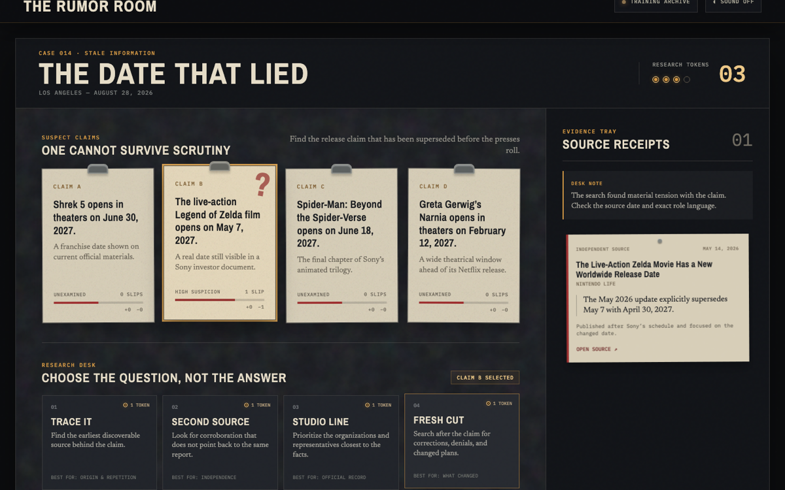
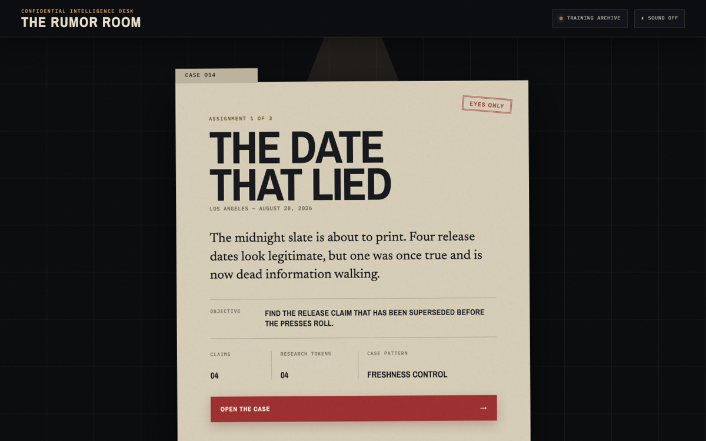
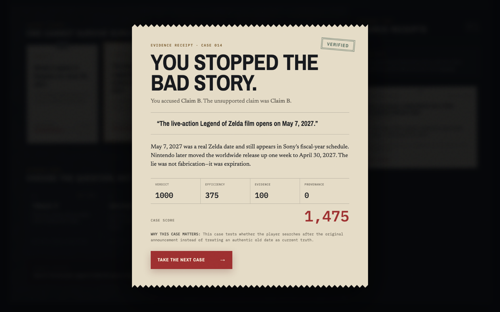
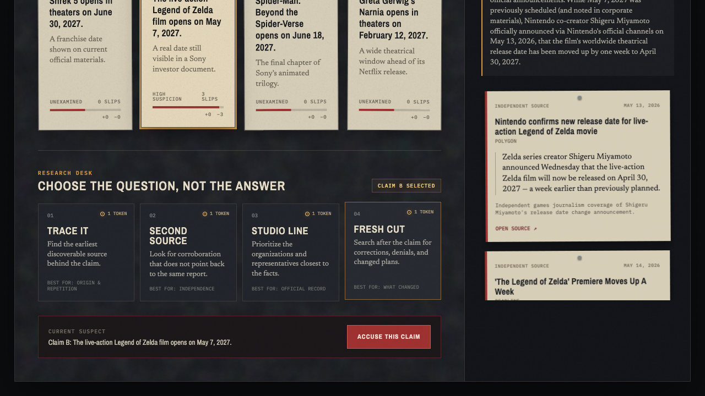
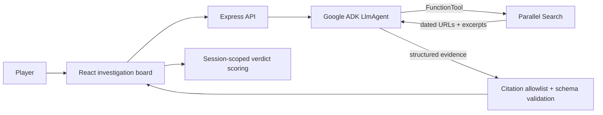

# The Rumor Room

**A noir web-investigation game where live evidence—not trivia—decides which entertainment claim cannot survive scrutiny.**

Built for the **Agentic Cinema: The Blockbuster Hackathon**, Parallel partner track.

**[Play the live game](https://rumor-room-dpq2d26l7q-uc.a.run.app)**



<details>
<summary>See the case briefing and evidence receipt</summary>







</details>

## The pitch

Four plausible claims arrive at the newsroom. The player has four research tokens and four structured moves:

- **Trace It** — find the earliest discoverable origin.
- **Second Source** — look for genuinely independent corroboration.
- **Studio Line** — prioritize the organizations closest to the facts.
- **Fresh Cut** — search after the claim for corrections, denials, and changed plans.

Every move calls a Gemini investigator built with Google ADK. Gemini chooses targeted queries, calls Parallel Search as a tool, evaluates provenance and freshness, and returns dated source receipts that physically change the case board. The player then accuses one claim and receives a scored evidence receipt.

## Why the integrations matter

Parallel is not an ornamental search box. Fresh web evidence is the game state.

- A stale date can look perfectly sourced until **Fresh Cut** finds the later announcement.
- Ten headlines can collapse into one origin when **Second Source** traces circular reporting.
- A famous producer can be promoted into the director's chair until **Studio Line** retrieves the exact credit.

Gemini is the investigator: it translates each strategic move into a focused research objective, operates the Parallel tool, and turns the tool output into a small, provenance-aware evidence bundle. The server rejects any citation that was not present in the actual Parallel response.

## Current build

- Three complete authored cases: stale information, circular sourcing, and headline distortion.
- Four-claim / four-token game loop with accusation, reveal, and scoring.
- Responsive physical evidence-board interface.
- Adaptive Tone.js electro-noir soundtrack and semantic cues.
- Mute control, audio-independent play, visible state communication, keyboard focus, and reduced-motion support.
- Deterministic local evidence mode for repeatable development.
- Production guard that refuses to launch the hosted submission in fixture mode.
- Google ADK 2.0 + Gemini 3.7 Flash + Parallel Search live provider.
- Unit, integrity, trust-boundary, desktop browser, and mobile browser tests.
- Cloud Run container and Cloud Build deployment configuration.

The complete Gemini → Google ADK → Parallel path has been exercised across all three authored cases and through a full browser verdict on the public Cloud Run deployment.

## Architecture



The client never receives the answer key. Evidence and scores are scoped to a generated player session. Production requires `INVESTIGATION_MODE=live`; fixture mode is intentionally limited to local development.

See [Architecture](docs/ARCHITECTURE.md) for the full request path and trust boundaries.

## Run locally

Requires Node.js 22 or newer.

```bash
npm install
cp .env.example .env
npm run dev
```

Open `http://127.0.0.1:5173`. The default `.env.example` uses deterministic fixture evidence.

## Run the live investigator locally

Authenticate with Google Cloud Application Default Credentials, add a Parallel API key, and change the following values in `.env`:

```dotenv
APP_ENV=development
INVESTIGATION_MODE=live
GOOGLE_CLOUD_PROJECT=your-project-id
GOOGLE_CLOUD_LOCATION=global
GOOGLE_GENAI_USE_ENTERPRISE=true
GOOGLE_MODEL=gemini-3.7-flash
PARALLEL_API_KEY=your-key
```

Then run `npm run dev`. The top-right status changes from **Training archive** to **Parallel live wire**.

## Quality gates

```bash
npm run check       # lint + unit tests + production build
npm run test:e2e    # Chromium desktop + mobile flows
npm audit           # dependency advisory check
```

Validated locally on August 28, 2026:

- 16 unit/integrity/trust-boundary tests passing.
- 11 browser scenarios passing across desktop and mobile with zero skips.
- Full three-case campaign and incorrect-verdict path covered in Chromium.
- Automated WCAG A/AA scans passing on the briefing and board at desktop and mobile sizes.
- Clean initial-load console and successful investigation/verdict network flow.
- All 22 unique authored source URLs returning HTTP 200.
- Zero npm audit vulnerabilities.
- Production fixture-mode guard verified.
- Production bundle budgets enforced: 206.8 KiB initial JavaScript, 23.8 KiB CSS, and lazy-loaded audio.
- Credential-free ADK simulation verifies that the real Google runner invokes the Parallel tool contract and returns grounded evidence.
- Credentialed live validation verifies all three intended contradictions, three runtime Parallel search IDs, an error-free live browser verdict, and successful live citation URLs.
- Production verification confirms a live Parallel search record in Cloud Run logs, an error-free public verdict, and zero WCAG A/AA violations on desktop and mobile.

## Deployment

The repository includes a multi-stage `Dockerfile` and `cloudbuild.yaml` for Google Cloud Run. Follow [Deployment](docs/DEPLOYMENT.md); it keeps the Parallel key in Secret Manager and runs the service with a dedicated identity that can call Vertex AI.

## Documentation

- [Architecture and trust boundaries](docs/ARCHITECTURE.md)
- [Case research and source record](docs/CASE_RESEARCH.md)
- [Case authoring guide](docs/CASE_AUTHORING.md)
- [Testing and QA evidence](docs/TESTING.md)
- [Live Gemini + Parallel validation](docs/LIVE_VALIDATION.md)
- [Google Cloud deployment runbook](docs/DEPLOYMENT.md)
- [Production deployment report](docs/DEPLOYMENT_REPORT.md)
- [Three-minute demo script](docs/DEMO_SCRIPT.md)
- [Devpost submission draft](docs/SUBMISSION.md)
- [Product decisions](docs/DECISIONS.md)
- [Changelog](CHANGELOG.md)
- [Security policy](SECURITY.md)

## License

MIT. See [LICENSE](LICENSE).
