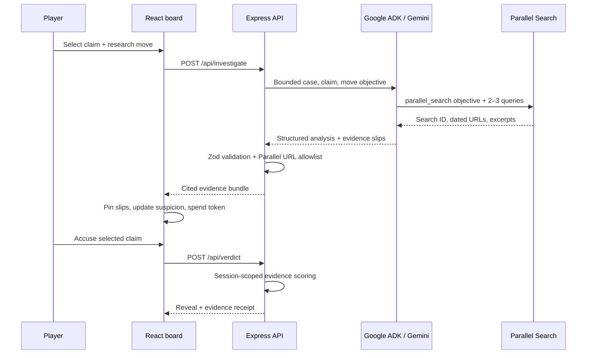

# Architecture

## Design goals

The architecture protects the core product claim: every hosted investigation must use Gemini on Google ADK and must call Parallel Search at runtime. At the same time, the game shell remains deterministic enough to design and test without spending external API credits.

## System map

## Client

The React client is a stateful game interface rather than a chat surface.

- `src/hooks/useRumorRoom.ts` owns the case phase, token budget, selected claim, evidence ledger, verdict, runtime badge, and audio preference.
- `src/components/Board.tsx` composes the claim board, research moves, evidence tray, and accusation control.
- `src/lib/game.ts` derives suspicion labels from the quality and stance of collected evidence.
- `src/lib/audio.ts` lazy-loads Tone.js after a user gesture and produces the adaptive score and semantic cues.
- Semantic cues also emit a visible, polite live-region caption so evidence feedback is available while muted.
- `src/lib/api.ts` is the only client transport boundary.

The client receives public case framing but never receives `unsupportedClaimId` or fixture evidence.

## Server

The Express server exposes four same-origin endpoints:

| Endpoint | Purpose |
| --- | --- |
| `GET /api/health` | Reports fixture/live provider readiness. |
| `GET /api/cases` | Returns public case data with answer keys removed. |
| `POST /api/investigate` | Runs one bounded research move. |
| `POST /api/verdict` | Scores one accusation using session-owned evidence. |

Requests are schema-validated with Zod, limited to 32 KB, and protected by a small in-memory investigation rate limit. Security headers and a restrictive Content Security Policy are applied to every response.

## Investigation provider boundary

Both providers return the same `InvestigationResponse` shape from `shared/types.ts`.

### Fixture provider

`server/providers/fixture-provider.ts` returns authored evidence from `shared/cases.ts`. It exists for deterministic UX work, tests, demos without credentials, and failure isolation.

Fixture mode is not permitted in production. `server/config.ts` throws during startup when `APP_ENV=production` and `INVESTIGATION_MODE` is not `live`.

### Live provider

`server/providers/live-provider.ts` creates:

1. A Google ADK `FunctionTool` named `parallel_search`.
2. A Google ADK `LlmAgent` running Gemini 3.7 Flash on Vertex AI.
3. An ephemeral ADK `Runner` invocation for the selected case and move.

Gemini must call the Parallel tool exactly once. The tool uses Parallel's official TypeScript SDK and requests live, date-aware excerpts. Gemini then classifies a compact evidence bundle by stance, quality, independence, and provenance.

Every case also supplies an ISO research cutoff. Gemini is instructed to judge the claim within that time boundary and ignore later developments, which keeps historical cases fair and reproducible.

## Citation trust boundary

The agent instruction says never to invent citations, but instructions alone are not a security boundary.

The Parallel tool records every URL it returned. After Gemini responds, the server:

1. Parses and validates the JSON shape.
2. Discards every evidence item whose URL was not in that tool response.
3. Fails the investigation if no tool-grounded citations remain.

This makes the visible receipt mechanically traceable to the runtime Parallel call.

## Session and scoring integrity

The browser creates a random UUID for each play session. Evidence returned by `/api/investigate` is recorded in a bounded, session-specific server ledger. `/api/verdict` only scores submitted evidence IDs that belong to the same session and case.

The scoring model rewards:

- Correct accusation with material evidence.
- Unused research tokens.
- Independent sources for the accused claim.
- Detection of circular sourcing.

## Production topology

The production image contains:

- Static Vite output in `dist/`.
- Compiled Node server output in `dist-server/`.
- Production-only dependencies.

Cloud Run serves the client and API from one origin. The runtime service account calls Vertex AI. The Parallel API key is mounted from Secret Manager. No browser-visible key or cloud credential is used.

## Failure behavior

- Failed searches do not spend a research token.
- Invalid agent JSON produces a generic 502 response and no evidence.
- Hallucinated citations are discarded.
- Missing live credentials mark the runtime unhealthy.
- Production fixture configuration refuses to boot.
- The game remains fully playable without audio and with reduced motion.
